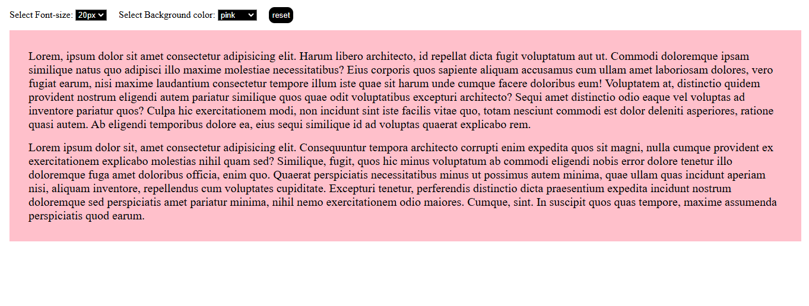

# Customizable Preference Webpage

This webpage allows users to customize font sizes and background colors by clicking on various buttons. User preferences are saved using localStorage, so settings persist across sessions.

## Features

- **Customizable Font Size**: Choose different font sizes by clicking corresponding buttons.
- **Changeable Background Colors**: Select different background colors for the page.
- **Persistent Preferences**: Settings are saved in localStorage, allowing preferences to persist after the page is reloaded.
- **Interactive UI**: Simple and responsive design for an easy user experience.

## Technologies Used

- **HTML**: Structure and layout of the page.
- **CSS**: Styling for font sizes, buttons, and background colors.
- **JavaScript**: Handles the logic for setting and retrieving preferences.
- **localStorage**: Stores user settings for persistent customization.

